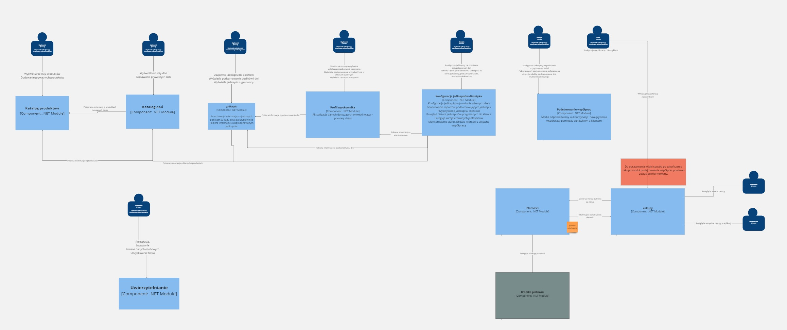

# Omniom

[](https://github.com/Shakkozu/omniom/actions/workflows/cicd.yml)

System umożliwiający prowadzenie jadłospisu oraz monitorowania aktualnego stanu zdrowia (wagi, pomiarów), rozszerzony o funkcjonalność koordynowania współpracy pomiędzy dietetykami oraz użytkownikami aplikacji, którzy monitorują swoje posiłki i sylwetkę

- [Omniom](#omniom)
  - [Powód powstania](#powód-powstania)
  - [Główne założenia](#główne-założenia)
    - [Możliwości komercjalizacji projektu](#możliwości-komercjalizacji-projektu)
  - [Baza produktowa](#baza-produktowa)
  - [Założenia projektowe](#założenia-projektowe)
    - [MVP](#mvp)
    - [Architektura](#architektura)
      - [Diagram architektury C4](#diagram-architektury-c4)
        - [C2 - Container level](#c2---container-level)
        - [C3 - Component level](#c3---component-level)
    - [Lista funkcjonalności do zrealizowania w MVP](#lista-funkcjonalności-do-zrealizowania-w-mvp)

---

## Uruchomienie projektu 

Do uruchomienia projektu potrzebny jest zainstalowany silnik dockera.

Repozytorium należy skopiować, następnie przejść do katalogu głównego aplikacji, oraz uruchomić komendę

```
docker compose up --build
```


Uruchomione zestaną 4 kontenery:
- angular-app - Klient angularowy aplikacji
- omniom-api - .NET API obsługujące żądania aplikacji klienckiej
- products-catalogue-db - Kontener z bazą danych postgres zawierającą dane dot. produktów (został odseparowany, aby umożliwić łatwe udostępnienie bazy produktów dalej na podstawie licencji z OpenFoodsApi)
- omniom-db - Kontener postgres z główną bazą danych aplikacji


Aplikacja webowa jest udostępniona na porcie `10005`, a więc aplikacja jest dostępna pod adresem:
```
http://localhost:10005/
```

W aplikacji zostało utworzone konto administratora, na które można się zalogować za pomocą:
```
login: admin@example.com
password: zaq1@WSX
```


---

## Powód powstania
Do utworzenia tego projektu zainspirował mnie kalkulator kalorii [Fitatu](https://www.fitatu.com/).

Korzystam z niego na codzień i uważam że kierunek rozwoju w celu roszerzenia zestawu funkcjonalności o współpracę z dietetykami jest słuszny, w związku z tym chciałbym spróbować stworzyć taki system żeby rozwinąć swoje umiejetności 

## Główne założenia

Zestaw założeń, wedle których planuję zaprojektować system:
- baza produktowa powinna być zasilona na starcie systemu, żeby użytkownik po rejestracji mógł od razu korzystać z funkcjonalności kalkulatora kalorii
- rejestracja dietetyków w systemie jest koordynowana przez administratora manualnie
- system koordynuje współpracę dietetyka z klientem, udostępniając dietetykowi informacje na temat wagi, pomiarów oraz historii odżywiania klientów
- dietetyk może skonfigurować swój zestaw posiłków/przepisów, aby budować jadłopisy dla swoich klientów

### Możliwości komercjalizacji projektu
Zakładam że projekt w przypadku wdrożenia na rynek mógłby zarabiać na podstawie:
- pobierania prowizji od opłaty uiszczanej dietetykowi za nawiązanie współpracy przez użytkownika aplikacji
- możliwości wykupowania promowania ogłoszeń przez dietetyków korzystających z systemu

## Baza produktowa
Baza produktów zostanie zasilona z [openfoodfacts](https://pl.openfoodfacts.org/)
Na start aplikacji skupię się jedynie na produktach dostępnych w polskiej wersji serwisu openfoodfacts.

--- 
## Założenia projektowe
Projekt jest realizowany w ramach konkursu [100commitow](https://100commitow.pl/) i ma na celu wspomóc budowanie nawyku codziennego poprawiania warsztatu technicznego.

### MVP
Aby zaprezentować system w postaci poprawnej na czas zakonczenia konkursu, lista dostępnych funkcjonalności zostanie okrojona w idei tworzenia MVP. 

W związku z tym w początkowej fazie projektu pominięte zostaną:
- stworzenie oddzielnej aplikacji mobilnej do korzystania dla użytkowników,
- integracja z serwerem uwierzytelniania,
- integracja z bramką płatniczą

### Architektura

System będzie się opierał na aplikacji SPA (angular) oraz .NET CORE
Projekt będzie realizowany w oparciu o podejście `vertical-slice` oraz `CQRS` aby poprawić umiejętności w tym zakresie.
Takie podejście umożliwi izolację każdej ścieżki biznesowej i wprowadzania punktowych optymalizacji w ramach potrzeb

#### Diagram architektury C4

##### C2 - Container level


##### C3 - Component level



### Lista funkcjonalności do zrealizowania w MVP

- **Uwierzytelnianie**
    - [x] Rejestracja użytkowników
    - [x] Logowanie użytkowników
- **Katalog Produktów**
    -  [x] Zasilenie bazy produktowej importem
    -  [x] Wyświetlanie listy produktów
- **Katalog dań**
    -  [x] Wyświetlanie listy dań
    -  [x] dodawanie prywatnych przepisów dań (instrukcja przygotowania, lista składników, liczba porcji)
- **Profil Użytkownika**
    -  [x] Ustalanie dziennego zapotrzebowania kalorycznego, wraz z rozwarstwieniem na makroskładniki
    -  [x] Wyświetlanie podsumowania przyjętych kalorii oraz makroskładników w okresach dziennych
- **Jadłospis**
    - [x] Konfiguracjia liczby posiłków w ciągu dnia
    - [x] Dodawanie listy zjedzonych produktów do posiłku
    - [x] Dodawanie dań do posiłku
    - [x] Dostosowywanie gramatur zjedzonych produktów/dań
    - [x] Usuwanie dania/produktu z listy zjedzonych pproduktów
    - [x] Przeglądanie historycznych posiłków
- **Konfiguracja Profilu Dietetyka**
    - [x] Przegląd zarejestrowanych dań
    - [ ] Konfiguracja jadłospisów na podstawie przygotowanych wcześniej dań
    - [ ] Przypisywanie jadłospisów do klientów
- **Nawiązywanie współprac**
    - [ ] Podejmowanie współprac pomiędzy dietetykiem a klientem

### Funkcjonalności do realizacji w kolejnych etapach projektu

- **Uwierzytelnianie**
    - Zmiana danych osobowych
    - Odzyskiwanie hasła
- **Katalog Produktów**
    - Dodawanie prywatnych produktów do bazy danych
- **Profil Użytkownika**
    - Aktualizacja danych dotyczących sylwetki (waga + pomiary ciała)
    - Generowanie raportów z postępami
- **Konfiguracja Profilu Dietetyka**
    - Generowanie raportów listy produktów potrzebnych do jadłospisu
    - Przegląd historiii jadłospisów przypisanych do klienta
    - Przegląd zarejestrowanych dań
    - Wyświetlanie monitorowania stanu zdrowia klientów z aktywną współpracą
- **Nawiązywanie współprac**
    - Przedłużanie współpracy
    - Anulowanie współpracy
- **Prowadzenie współprac**
    - Proponowanie jadłospisu klientom
    - Monitorowanie stanu zdrowia klientów
- **Chat**
    - Komunikacja pomiędzy użytkownikami (w głównej mierzy pomiędzy klientami oraz dietetykami)
    - Lista konswersacji

- **Ogłoszenia**
    - Dodawanie szkiców ogłoszeń przez dietetyka
    - Akceptacja ogłoszeń przez administratora
    - Zgłaszanie uwag do proponowanego ogłoszenia przez administratora
    - Publikacja Ogłoszeń

- **Katalog ogłoszeń**
    - Wyświetlanie listy ogłoszeń
    - Promowanie ogłoszeń

- **Moduł zakupów**
    - Zakup promowania ogłoszenia
    - Zakup współpracy z dietetykiem
    - Wyświetlanie listy zakupów dla użytkownika
    - Wyświetlanie listy zakupów dla administratora

- **Płatności**
    - Możliwość uiszczania opłat z pomocą bramki płatniczej za zakupy
    - Wyświetlanie listy płatności przez administratora

